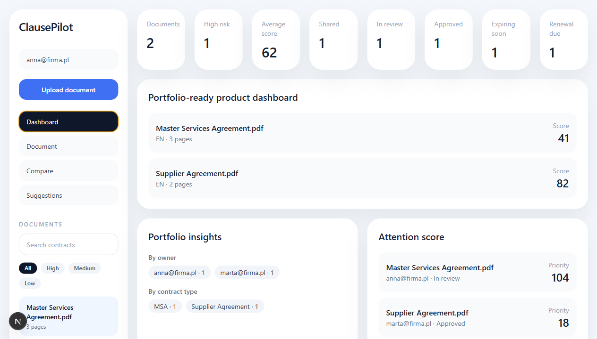
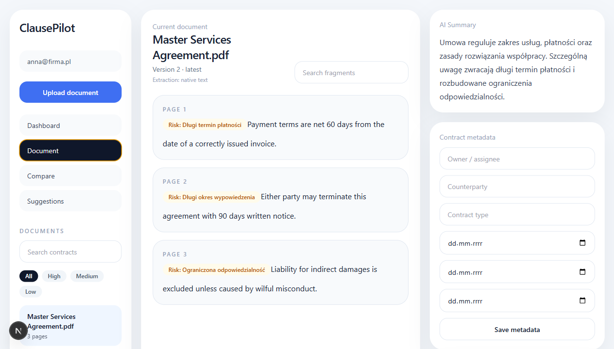
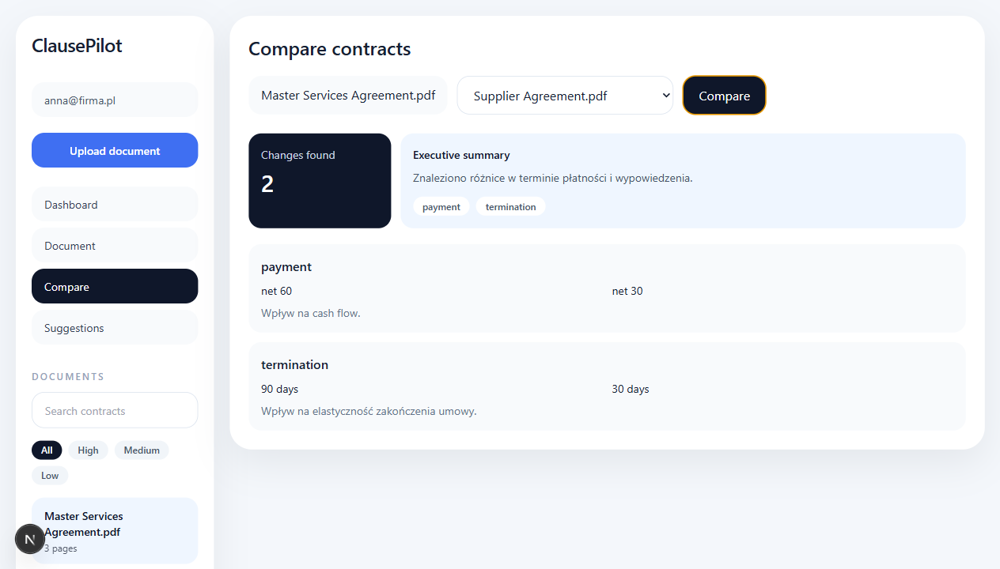

# LuminaClause


> Local-first AI contract review workspace for summarizing agreements, asking grounded questions, comparing versions, and surfacing risky clauses before human review.

LuminaClause is built as a practical **AI Contract / Document Assistant** rather than a toy chatbot: it keeps the source text close, explains why a clause matters, and supports the review work around the document itself.

## Product snapshot



| Area | What it does |
| --- | --- |
| Understand | summaries, fragment search, grounded Q&A with citations and chat history |
| Review | risk detection, scoring, suggested safer wording |
| Compare | side-by-side contract comparison and impact notes |
| Collaborate | local auth mock, ownership, comments, sharing, review statuses, activity history |
| Operate | landing page, drag-and-drop upload, deadlines, review queue, dashboard, exportable reports |

## Product screenshots

### Dashboard

Portfolio metrics, risk triage, review queue, and deadline overview.


### Document workspace

Extracted clauses, AI summary, metadata, risk labels, conversation history, and review controls.



### Contract comparison

Side-by-side differences with an executive summary and impact notes.




## Portfolio value

LuminaClause is built to show practical full-stack product engineering, not just isolated AI calls. The project demonstrates:

- product thinking around a real document-review workflow,
- frontend execution with a polished dashboard and review workspace,
- backend API design with FastAPI and validated payloads,
- local RAG-ready retrieval and source-grounded answers,
- test coverage, CI, Docker runtime, API docs, and operational endpoints,
- a clean migration path toward OpenAI/Azure OpenAI, PostgreSQL, pgvector, storage, and cloud deployment.

Useful portfolio materials:

- [Architecture notes](docs/architecture.md)
- [API reference](docs/api.md)
- [Local MVP release checklist](docs/release-checklist.md)
- [Portfolio summary](docs/portfolio-summary.md)
- [Deployment guide](docs/deployment.md)
- [Claude handoff](CLAUDE.md)
- [Detailed Claude handoff](docs/claude-handoff.md)

## Why it is useful

Contract review is often slow, repetitive, and opaque for non-lawyers. LuminaClause shortens the first-pass review loop by helping users:

1. find the important clauses,
2. understand the commercial impact,
3. keep every answer traceable to the original document,
4. move the contract through a lightweight human review workflow.

## Feature highlights

### 1. Explainable document chat

Questions return not only an answer, but also the supporting contract passages that justify it. The workspace keeps a local conversation history so a reviewer can see the question trail for the selected document.

### 2. Contract risk review

The app highlights risky clauses, scores the document, and proposes safer wording that a reviewer can inspect before acting.

### 3. Review workflow

Each contract can move through `Draft`, `In review`, and `Approved`, with comments and activity history preserving the human review trail.

### 4. Portfolio-level triage

The dashboard shows high-risk contracts, items awaiting review, approved documents, and a review queue that puts the weakest agreements first.

### 5. Exportable output

Users can generate and download a markdown report that is ready to share or convert into a polished PDF later. Documents can also be archived from the workspace through the API and UI.

## Why the project is built this way

The product is intentionally developed **without cloud AI first**. That keeps the core workflow testable end-to-end while the local analysis layer acts as a clean substitute for the future provider layer.

Current local engine:

- PDF text extraction,
- sentence ranking,
- keyword-based retrieval,
- rules-based risk detection,
- deterministic suggestions,
- local JSON persistence.

Optional local OCR:

- native PDF text extraction runs first,
- scanned PDFs can fall back to OCR when the optional OCR dependencies are installed,
- OCR uses PyMuPDF with a locally installed Tesseract engine,
- enable the optional path with `pip install -r backend/requirements-ocr.txt`.

Provider architecture:

- a shared analysis provider contract,
- a local provider active today,
- a clean seam for future OpenAI / Azure OpenAI providers.

Configuration today:

```env
ANALYSIS_PROVIDER=local
```

The app already reads the provider choice from environment variables, so switching intelligence backends later does not require changing the product flow.

Future provider layer:

- OpenAI / Azure OpenAI for richer summaries and Q&A,
- embeddings for semantic retrieval,
- PostgreSQL + pgvector,
- object storage,
- hosted deployment.

## Product shape

### Core

- Document workspace
- AI summary
- risk analysis
- Q&A with local chat history
- markdown-rendered answers and reports
- fragment search
- drag-and-drop upload with progress

### Pro-style features

- contract comparison
- scoring
- AI suggestions
- multi-language flag
- local email session mock
- ownership-aware uploads
- sharing
- dashboard
- review comments
- review status workflow
- review queue
- exportable reports
- document archive workflow
- health and metrics endpoints for production-readiness checks

## Stack

- Frontend: Next.js + TypeScript + Tailwind
- Backend: Python + FastAPI
- Storage now: local filesystem + JSON
- Planned persistence: PostgreSQL + pgvector
- Containerization: Docker + Docker Compose
- Planned cloud: AWS or Azure

## Architecture

```text
Next.js frontend
      |
      v
FastAPI backend
      |
      +--> local document store
      +--> analysis provider interface
              |
              +--> local provider now
              +--> hosted provider later
```

The product is intentionally split so the user-facing workflow can stay stable while the intelligence layer evolves from local heuristics to hosted AI and vector search. The backend also exposes `GET /health` and `GET /metrics` so the local MVP already has a production-style seam for monitoring.

## Deployment

The recommended first portfolio deployment is:

- Backend: Render Docker web service using `render.yaml`
- Frontend: Vercel project with `frontend` as the root directory

See the full [deployment guide](docs/deployment.md).

## Docker Compose

Run the full stack in production-like containers:

```powershell
docker compose up --build
```

Then open:

- frontend: `http://localhost:3000`
- backend docs: `http://localhost:8000/docs`

The frontend proxies `/api/*` to the backend container through `INTERNAL_API_URL`, so the browser talks to one frontend origin while the server-side rewrite reaches FastAPI internally. Backend data is stored in the `backend-data` Docker volume.

## Local run

### Fast path on Windows

```powershell
.\scripts\check-local.cmd
.\scripts\bootstrap.cmd
.\scripts\run-local.cmd
```

That flow:

- checks whether Python, Node.js, and npm are available,
- creates the backend virtual environment,
- installs backend and frontend dependencies,
- creates local environment files from examples,
- starts both services together.

If you prefer manual control, use the steps below.

### Backend

```powershell
cd backend
python -m venv .venv
.\.venv\Scripts\activate
pip install -r requirements.txt
uvicorn app.main:app --reload
```

### Optional OCR support

For scanned PDFs, install the optional OCR dependencies and Tesseract locally:

```powershell
cd backend
pip install -r requirements-ocr.txt
```

You also need the Tesseract executable available on your machine. PyMuPDF invokes Tesseract for OCR pages, so the main app remains usable even when OCR is not installed.

### Frontend

```powershell
cd frontend
npm install
npx next dev -p 3004
```

Open:

- frontend: `http://localhost:3004`
- backend docs: `http://localhost:8000/docs`

## Local demo fallback

### Local auth mode

LuminaClause includes a lightweight local auth simulation for portfolio review:

- email-based login/register UI,
- browser-local session persistence,
- uploaded documents tagged with the current workspace owner,
- sign-out flow,
- clear migration seam for Clerk, Supabase Auth, or JWT later.

This is intentionally not a production auth provider; it demonstrates the product boundary before cloud identity is added.


If package installation is blocked on a given machine, there is also a lightweight local demo mode that reuses the same analysis logic but runs on libraries already available in the environment:

```powershell
python local_demo\app.py
```

Then open:

- local demo: `http://127.0.0.1:5050`

## Quick demo path

1. Start the backend and frontend, or use the lightweight local demo mode.
2. Upload `samples/master-services-agreement.txt`.
3. Upload `samples/supplier-agreement.txt`.
4. Ask: `What are the payment terms?`
5. Ask a follow-up question and inspect the conversation history with cited source passages.
6. Add a reviewer comment and move the first contract into `In review`.
7. Open the comparison view and compare both documents.
8. Inspect the review queue, suggested edits, and supporting passages below the answer.
9. Generate and download a contract review report.
10. Archive a document when it leaves the local review queue.

## What makes this portfolio-ready

- Real product framing around a concrete workflow, not just generic chat
- Polished AI interaction details: markdown-rendered AI answers, report preview, citations, and chat history
- Full-stack delivery across Next.js and FastAPI
- Explainable AI-oriented architecture with citations and a swappable provider layer
- Workflow features beyond MVP: local auth mock, ownership, comments, status, deadlines, review queue, archive flow, markdown report preview, export
- Automated backend/API tests, upload guardrail coverage, and frontend production build checks
- Fresh-clone bootstrap scripts and Docker Compose for repeatable setup
- Clear migration path from local prototype to hosted AI and cloud persistence


## Validation

Current local checks:

- Backend test suite: `31 passed`
- Frontend production build: `next build` passes
- GitHub Actions: backend tests + frontend build on push and pull request
- Docker Compose stack: frontend + FastAPI backend with persistent backend volume
- Manual end-to-end flow verified: upload -> analysis -> document view -> chat history -> compare -> archive

## Fresh-clone checklist

After cloning the repository on a new machine:

1. Run `.\scripts\check-local.cmd`
2. Run `.\scripts\bootstrap.cmd`
3. Run `.\scripts\run-local.cmd`
4. Open `http://localhost:3004`
5. Upload the files from `samples/`
6. Confirm that backend tests pass with `python -m pytest backend/tests`

## Main API endpoints

Full API reference with examples: [`docs/api.md`](docs/api.md).

Local MVP release checklist: [`docs/release-checklist.md`](docs/release-checklist.md).


### Upload safety

The local API applies production-minded guardrails before analysis starts:

- PDF/TXT files only,
- empty files rejected,
- 5 MB local demo upload limit,
- sanitized filenames before writing temporary files,
- unreadable documents rejected with controlled API errors.


- `GET /dashboard`
- `GET /documents`
- `POST /documents/upload`
- `POST /documents/bulk-upload`
- `GET /documents/{id}`
- `DELETE /documents/{id}`
- `GET /documents/{id}/search`
- `POST /documents/{id}/ask`
- `POST /documents/{id}/share`
- `POST /documents/{id}/comments`
- `POST /documents/{id}/status`
- `GET /documents/{id}/report`
- `POST /compare`

## Demo materials

The `samples/` directory contains two small contract examples that are useful when demonstrating the comparison and risk-analysis flow. They can be uploaded directly as `.txt` files:

- `master-services-agreement.txt`
- `supplier-agreement.txt`

## Roadmap toward production

1. Replace local heuristic analysis with provider adapter
2. Add PostgreSQL + pgvector
3. Add real authentication and permissions
4. Store files in S3 / Blob Storage
5. Add audit log, comments, and workspace roles
6. Deploy frontend + backend
