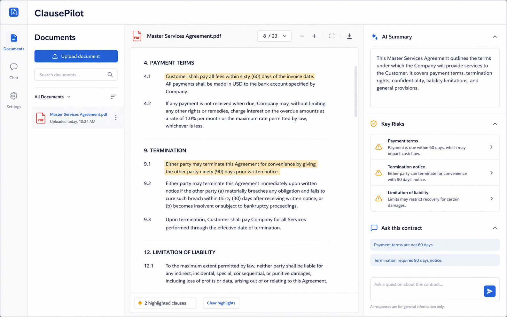

# ClausePilot

ClausePilot is a local-first **AI Contract / Document Assistant** for people who need to understand agreements quickly, compare versions, and spot risky clauses before sending them onward.

## Preview



## What it already does

- upload PDF and TXT documents,
- generate summaries,
- search document fragments,
- answer questions with supporting passages,
- detect contract risks,
- calculate an overall risk score,
- suggest safer clause wording,
- compare two documents,
- share documents with collaborators,
- show a lightweight dashboard,
- keep a local document history.

## Why the project is built this way

The product is intentionally developed **without cloud AI first**. That keeps the core workflow testable end-to-end while the local analysis layer acts as a clean substitute for the future provider layer.

## Why this matters

Contract review is often slow, repetitive, and hard to navigate for people who are not lawyers. ClausePilot is designed to shorten the first-pass review loop: surface the important parts, explain why they matter, and keep the original text close enough that the user can verify every answer.

Current local engine:

- PDF text extraction,
- sentence ranking,
- keyword-based retrieval,
- rules-based risk detection,
- deterministic suggestions,
- local JSON persistence.

Future provider layer:

- OpenAI / Azure OpenAI for richer summaries and Q&A,
- embeddings for semantic retrieval,
- PostgreSQL + pgvector,
- object storage,
- hosted deployment.

## Product shape

### Core

- Document workspace
- AI summary
- risk analysis
- Q&A
- fragment search

### Pro-style features

- contract comparison
- scoring
- AI suggestions
- multi-language flag
- sharing
- dashboard

## Stack

- Frontend: Next.js + TypeScript + Tailwind
- Backend: Python + FastAPI
- Storage now: local filesystem + JSON
- Planned persistence: PostgreSQL + pgvector
- Planned cloud: AWS or Azure

## Architecture

```text
Next.js frontend
      |
      v
FastAPI backend
      |
      +--> local document store
      +--> local analyzer
      +--> future AI provider adapter
```

The product is intentionally split so the user-facing workflow can stay stable while the intelligence layer evolves from local heuristics to hosted AI and vector search.

## Local run

### Backend

```powershell
cd backend
python -m venv .venv
.\.venv\Scripts\activate
pip install -r requirements.txt
uvicorn app.main:app --reload
```

### Frontend

```powershell
cd frontend
npm install
npm run dev
```

Open:

- frontend: `http://localhost:3000`
- backend docs: `http://localhost:8000/docs`

## Local demo fallback

If package installation is blocked on a given machine, there is also a lightweight local demo mode that reuses the same analysis logic but runs on libraries already available in the environment:

```powershell
python local_demo\app.py
```

Then open:

- local demo: `http://127.0.0.1:5050`

## Main API endpoints

- `GET /dashboard`
- `GET /documents`
- `POST /documents/upload`
- `GET /documents/{id}`
- `GET /documents/{id}/search`
- `POST /documents/{id}/ask`
- `POST /documents/{id}/share`
- `POST /compare`

## Demo materials

The `samples/` directory contains two small contract examples that are useful when demonstrating the comparison and risk-analysis flow. They can be uploaded directly as `.txt` files:

- `master-services-agreement.txt`
- `supplier-agreement.txt`

## Roadmap toward production

1. Replace local heuristic analysis with provider adapter
2. Add PostgreSQL + pgvector
3. Add real authentication and permissions
4. Store files in S3 / Blob Storage
5. Add audit log, comments, and workspace roles
6. Deploy frontend + backend

## Portfolio angle

This repository demonstrates:

- product thinking,
- full-stack development across frontend and backend,
- document processing with PDF extraction,
- AI-oriented architecture with a swappable intelligence layer,
- API design for upload, search, chat, sharing, and comparison flows,
- explainability patterns through citations and risk scoring,
- test coverage for core analysis rules,
- UI design for a product-style dashboard,
- a clean migration path from local prototype to cloud product.
